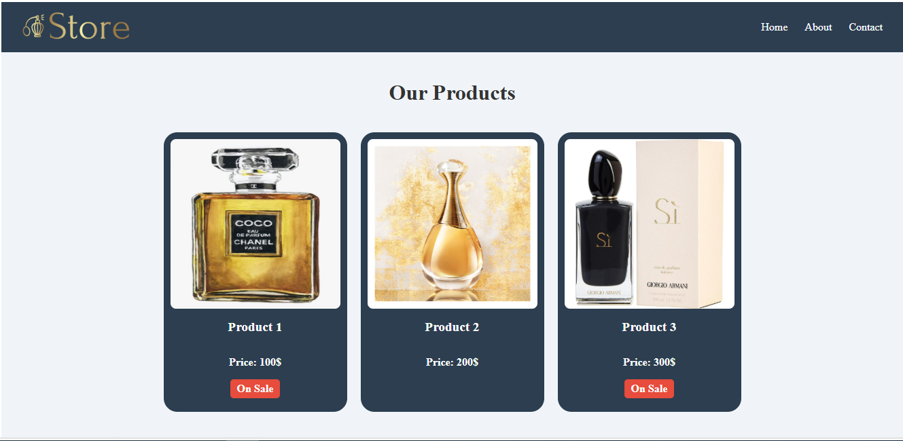
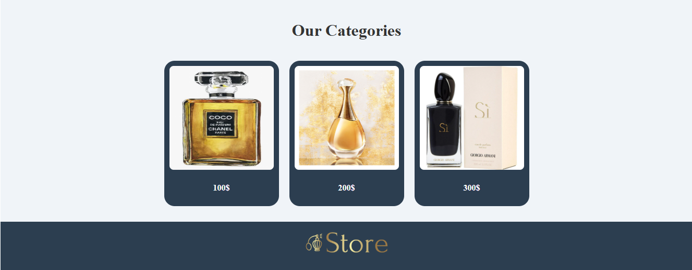

## simple product and category display page using Angular
## 


### Products



This screenshot shows navbar and how the product cards appear on the page, with product images, names, and prices displayed in a clean and organized manner.

### Categories



This screenshot shows footer and how the category cards are displayed. Each card contains an image of the category and the price associated with it.

## Development server

To start a local development server, run:

```
ng serve
```

## Code scaffolding

Angular CLI includes powerful code scaffolding tools. To generate a new component, run:

```
ng generate component component-name
```


## Building

To build the project run:

```bash
ng build
```

