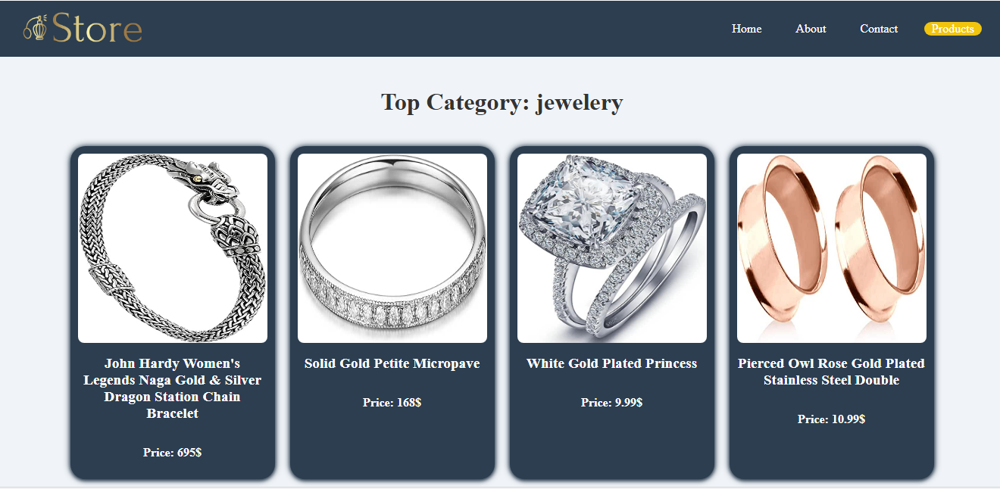
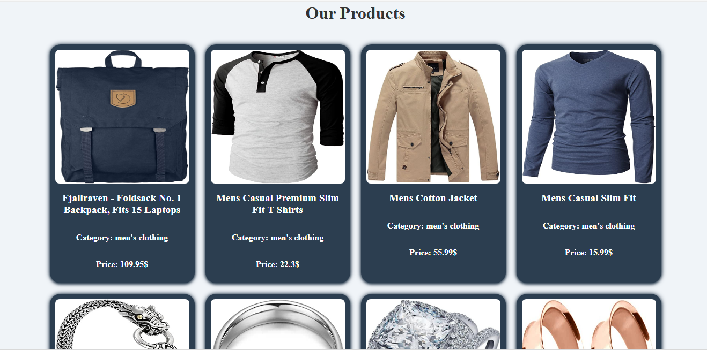
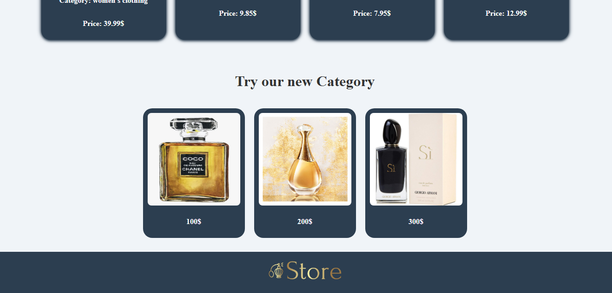

## simple E-commerce using Angular
##

###  Top Category

This screenshot shows navbar and how the top Category appear on the page, with product images, title, and prices displayed in a clean and organized manner.


### All Products



This screenshot shows how the product cards appear on the page, with product images, names, and prices displayed in a clean and organized manner.


## New Category


This screenshot shows footer and new category cards are displayed. Each card contains an image of the product and the price associated with it.

## Features
This project displays products categorized into different sections using Angular. It uses advanced routing and defer loading techniques to optimize the user experience.

### Routing
The application uses Angular's built-in routing to navigate between different pages. The routes are configured in the `app-routing.module.ts` file, allowing users to switch between various views such as Home, About, Contact, and Products.

- The routes are defined as follows:
  - **Home:** `path: 'home'`
  - **About:** `path: 'about'`
  - **Contact:** `path: 'contact'`
  - **Products:** `path: 'products'`

In each of the views, components are rendered dynamically based on the route, making it easy to manage different sections of the application.

### Lazy Loading with `@defer`
To enhance the loading time and performance of the application, we used **defer loading** for the `Products` section. By using the `@defer` directive, the product data and its associated components will only load when they are about to come into the user's viewport, which helps improve initial page load time.

- The `Products` section is lazy-loaded, which means:
  - **The Top Category** section is rendered immediately upon page load.
  - **The Products** section will be loaded dynamically only when the user scrolls down to it, making the app faster and more efficient.


## Development server

To start a local development server, run:

```
ng serve
```

## Code scaffolding

Angular CLI includes powerful code scaffolding tools. To generate a new component, run:

```
ng generate component component-name
```


## Building

To build the project run:

```bash
ng build
```

